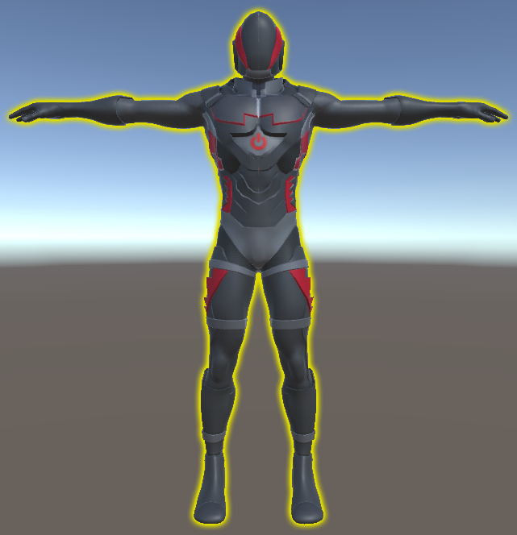

# UnityFx.Outline

Channel | UnityFx.Outline |
---------|---------------|
Github | [](https://github.com/Arvtesh/UnityFx.Outline/releases)
Npm | [](https://www.npmjs.com/package/com.unityfx.outline) 

**Requires Unity 2017 or higher.**<br/>
**Compatible with [Unity Post-processing Stack v2](https://github.com/Unity-Technologies/PostProcessing/tree/v2).**

**Please ask any questions and leave feedback at the [Unity forums](https://forum.unity.com/threads/screen-space-outline-effect-for-unity-free.836908/).**

## Synopsis



*UnityFx.Outline* implements configurable per-object and per-camera outlines. Both solid and blurred outline modes are supported (Gauss blur). The outlines can be easily customized either through scripts or with Unity editor (both in edit-time or runtime).

Implementation is based on Unity [command buffers](https://docs.unity3d.com/ScriptReference/Rendering.CommandBuffer.html), compatible with [Unity Post-processing Stack v2](https://github.com/Unity-Technologies/PostProcessing/tree/v2), extendable and has no external dependencies.

Supported outline parameters are:
- Color;
- Width (in pixels);
- Type (solid or blurred);
- Intensity (for blurred outlines).

Supported platforms:
- Windows/Mac standalone;
- Android;
- iOS.

Please see [CHANGELOG](CHANGELOG.md) for information on recent changes.

## Getting Started
### Prerequisites
You may need the following software installed in order to build/use the library:
- [Unity3d 2017+](https://store.unity.com/).

### Getting the code
You can get the code by cloning the github repository using your preffered git client UI or you can do it from command line as follows:
```cmd
git clone https://github.com/Arvtesh/UnityFx.Outline.git
```

### Npm package
[](https://www.npmjs.com/package/com.unityfx.outline)

Npm package is available at [npmjs.com](https://www.npmjs.com/package/com.unityfx.outline). To use it, add the following line to dependencies section of your `manifest.json`. Unity should download and link the package automatically:
```json
{
  "scopedRegistries": [
    {
      "name": "Arvtesh",
      "url": "https://registry.npmjs.org/",
      "scopes": [
        "com.unityfx"
      ]
    }
  ],
  "dependencies": {
    "com.unityfx.outline": "0.7.0"
  }
}
```

## Usage
Install the package and import the namespace:
```csharp
using UnityFx.Outline;
```

### Per-camera outlines


Add `OutlineEffect` script to a camera that should render outlines. Then add and configure as many layers as you need:
```csharp
var outlineEffect = Camera.main.GetComponent<OutlineEffect>();
var layer = new OutlineLayer("MyOutlines");

layer.OutlineColor = Color.red;
layer.OutlineWidth = 7;
layer.OutlineMode = OutlineMode.Blurred;
layer.Add(myGo);

outlineEffect.OutlineLayers.Add(layer);
```

This can be done at runtime or while editing a scene. If you choose to assign the script in runtime make sure `OutlineEffect.OutlineResources` is initialized. Disabling `OutlineEffect` script disables outlining for the camera (and frees all resources used).

Multiple `OutlineEffect` scripts can share outline layers rendered. To achieve that assign the same layer set to all `OutlineEffect` instances:

```csharp
var effect1 = camera1.GetComponent<OutlineEffect>();
var effect2 = camera2.GetComponent<OutlineEffect>();

// Make effect1 share its layers with effect2.
effect1.ShareLayersWith(effect2);
```

### Per-object outlines


Add `OutlineBehaviour` script to objects that should be outlined (in edit mode or in runtime). Make sure `OutlineBehaviour.OutlineResources` is initialized. You can customize outline settings either via Unity inspector or via script. Objects with `OutlineBehaviour` assigned render outlines in all cameras.

```csharp
var outlineBehaviour = GetComponent<OutlineBehaviour>();

// Make sure to set this is OutlineBehaviour was added at runtime.
outlineBehaviour.OutlineResources = myResources;

outlineBehaviour.OutlineColor = Color.green;
outlineBehaviour.OutlineWidth = 2;
outlineBehaviour.OutlineIntensity = 10;
```

### Extensibility
There are a number of helper classes that can be used for writing highly customized outline implementations (if neither `OutlineBehaviour` nor `OutlineEffect` does not suit your needs).
All outline implementations use following helpers:
- `OutlineRenderer` is basically a wrapper around `CommandBuffer` for low-level outline rendering.
- `OutlineSettings` is a set of outline settings.

Using these helpers is quite easy to create new outline tools. For instance, the following code renders a blue outline around object the script is attached to in `myCamera`:

```csharp
var commandBuffer = new CommandBuffer();
var renderers = GetComponentsInChildren<Renderer>();

// Any implementation of `IOutlineSettings` interface can be used here instead of `OutlineSettings`.
var settings = ScriptableObject.CreateInstance<OutlineSettings>();

settings.OutlineColor = Color.blue;
settings.OutlineWidth = 12;

// Get outline assets instance. In real app this usually comes from MonoBehaviour's serialized fields.
var resources = GetMyResources();

using (var renderer = new OutlineRenderer(commandBuffer, BuiltinRenderTextureType.CameraTarget))
{
  renderer.Render(renderers, resources, settings);
}

myCamera.AddCommandBuffer(OutlineRenderer.RenderEvent, commandBuffer);
```

### Integration with Unity post-processing.

The outline effect can easily be added to [Post-processing Stack v2](https://github.com/Unity-Technologies/PostProcessing/tree/v2). A minimal integration example is shown below:
```csharp
using System;
using UnityEngine;
using UnityEngine.Rendering.PostProcessing;
using UnityFx.Outline;

[Serializable]
[PostProcess(typeof(OutlineEffectRenderer), PostProcessEvent.BeforeStack, "MyOutline", false)]
public sealed class Outline : PostProcessEffectSettings
{
  public OutlineResources OutlineResources;
  public OutlineLayers OutlineLayers;
}

public sealed class OutlineEffectRenderer : PostProcessEffectRenderer<Outline>
{
  public override void Render(PostProcessRenderContext context)
  {
    using (var renderer = new OutlineRenderer(context.command, context.source, context.destination))
    {
      settings.OutlineLayers.Render(renderer, settings.OutlineResources);
    }
  }
}
```
For the sake of simplicity the sample does not include any kind of error checking and no editor integration provided. In real world app the `Outline` class should expose its data to Unity editor either via custom inspector or using parameter overrides. Also, there are quite a few optimizations missing (for example, resusing `RuntimeUtilities.fullscreenTriangle` value as `OutlineResources.FullscreenTriangleMesh`).

More info on writing custom post processing effects can be found [here](https://docs.unity3d.com/Packages/com.unity.postprocessing@2.2/manual/Writing-Custom-Effects.html).

## Motivation
The project was initially created to help author with his [Unity3d](https://unity3d.com) projects. There are not many reusable open-source examples of it, so here it is. Hope it will be useful for someone.

## Documentation
Please see the links below for extended information on the product:
- [Unity forums](https://forum.unity.com/threads/screen-space-outline-effect-for-unity-free.836908/).
- [CHANGELOG](CHANGELOG.md).
- [SUPPORT](.github/SUPPORT.md).

## Useful links
- [A great outline tutorial](https://willweissman.wordpress.com/tutorials/shaders/unity-shaderlab-object-outlines/).
- [Command buffers tutorial](https://lindenreid.wordpress.com/2018/09/13/using-command-buffers-in-unity-selective-bloom/).
- [Gaussian blur tutorial](https://www.ronja-tutorials.com/2018/08/27/postprocessing-blur.html).
- [Excellent post-processing tutorial](https://catlikecoding.com/unity/tutorials/scriptable-render-pipeline/post-processing/).

## Contributing
Please see [contributing guide](.github/CONTRIBUTING.md) for details.

## Versioning
The project uses [SemVer](https://semver.org/) versioning pattern. For the versions available, see [tags in this repository](https://github.com/Arvtesh/UnityFx.Outline/tags).

## License
Please see the [](LICENSE.md) for details.
